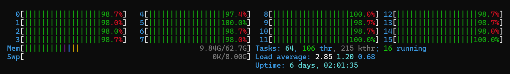

# Results

## Final throughput numbers

2 clients and 2 servers: total `~17M op/s`

4 clients and 4 servers: total `~todo`

## Hardware utilization metrics

pprof results:

`todo todo todo`

htop server sample during execution, showing fantastic CPU utilization:

## Scaling characteristics 

Due to sharding and high levels of parallelism, our solution scales well with an increased number of machines. Below are the metrics:

1 client 1 sever: `todo`

2 client 2 severs: `~17M op/s`

4 clients 4 servers: `todo`

## Performance & Scale Charts

Can put above into a chart, but I think we can get away without it.

# Design

## Successful Ideas
We implemented the following:
### Batching
Generating an RPC call per each Get/Put operation is costly and inefficient. Instead, we implemented request batching, where a batch of operations is sent in a single RPC call. This significantly reduces networking overhead, allowing for better performance both on clients and servers. We also found that a signficant amount of time was spent serializing and deserializing rpc payloads, calling handler functions, and most crucially spinning up a new goroutine per request (even over the same TCP connection). This operational logic was far more costly then the business logic which was often a lookup into the L1 cache.
### Async RPC 
By default, clients made RPC calls synchronously to the server, meaning that each request was waited upon until completion. Instead, we implemented asynchronous RPC calls, significantly boosting client throughput. This removed head of line blocking between batches while not affecting linearizability from the servers POV, as the client gives up guarantees by not awaiting.
### Sharding
We sharded between and within machines. The client was responsible for consistently routing a key to the same server. Each server itself had many shards each with their own Reader Writer lock. This simulated a sharding + bucket lock design. The goal of this was to make each machine have roughly equal load and reduce lock contention within machines, so that the CPU was not idle. We implemented this after batching so the CPU was no longer hitting capactiy on small payloads because it didn't have to deal with RPC overhead.
### Client-side parallelism
Each client has multiple go routines pulling keys and sending batched request. This is required to maxamize CPU utilization on the client and servers (do to increased load). Just running multiple clients on multiple machines is not enough. One 16 core machine requires around 20 client routines to go from 50% to 1600% CPU utilization.
### At least once scheme
todo

## Failed Ideas
We implemented the following without getting performance improvments:
### Fine-grained locking
Storing a (value, RWlock) tuple to have fine grained key locking had a 2x slowdown because the extra controlflow was signficiantly more expensive than the business operations. 

### Worker Threads
We attempted to maintain a pool of workers and distribute. batch workloads among them via channels but found serializable execution to be as fast if not faster. Although having a pool solved the problem of goroutine creation overhead, switching on each action and routing to the correct channel and then awaiting in the case of a put on a temporary channel or state proved costly. 

# Reproducibility
Our experiments were done on 8 CloudLab m510 machines.

run `./run-cluster.sh <server_count> <client_count> "-numshards <#>" "-asynch=<True/False> -connections <#>"`

For example, for best results:

`./run-cluster.sh 4 4 "-numshards 1000" "-asynch=True -connections 70"`

The number of shards is per server, so in total you will have `server_count * numshards`. 

`-connections` is how many goroutines each client machine runs. For optimal performance we suggest doing an exponential grid search followed by linear finetuning.

`-asynch` flag enables asynchronous RPC calls. Choose `true` for best performance.

`-connections` flag defines the number of parallel threads per client. 

# Reflections

Peeling back the onion is an invarient of optimizing. Being able to understand typical latencies for network and machine operations and in what cases they occur allow you to measure what matters. This should be done before optimizing as it is often less time consuming and pays dividends. But, just cause you see opportunity--low cpu usage, bad IPC, cache misses, high cost functions, blocking, lock contention--doesn't mean it will be easy to fix as the solutions come with tradeoffs or unexpected consequences. And sometimes the Usual Suspects drive you up the wrong wall. 

Individual contributions from each team member:

- Artem: batching, asynch RPC
- Ash: 
- Brendon: client side concurrency, sharding, failed ideas
- Cayden:
